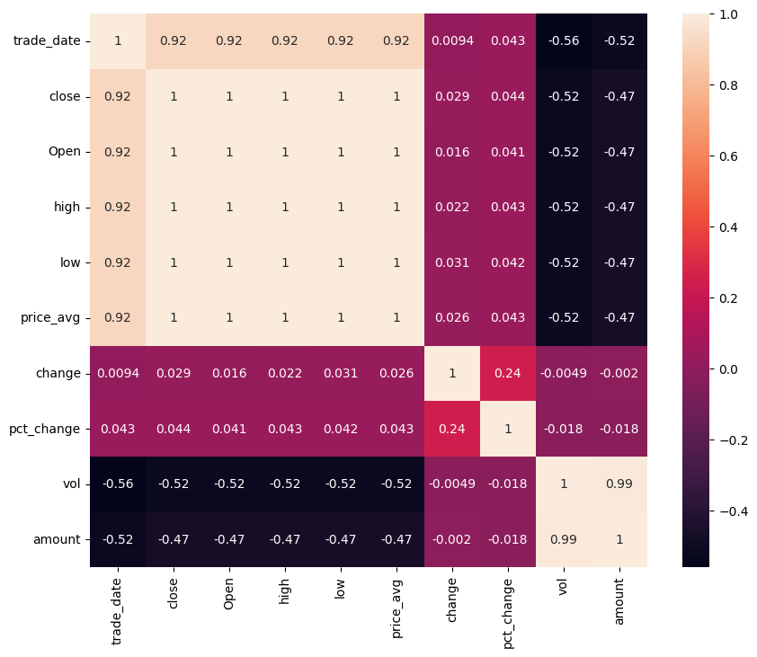
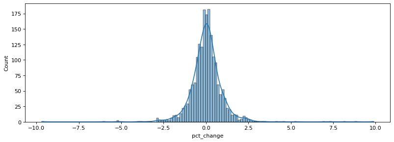
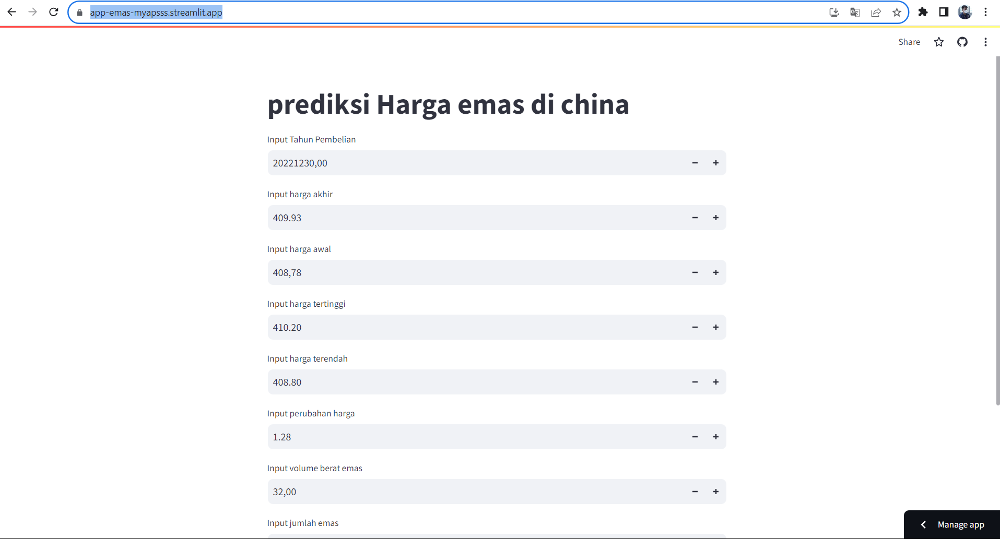

# Laporan Proyek Machine Learning
### Nama : Satrya Wirangga PermanaPutra
### Nim : 211351138
### Kelas : Pagi B

## Domain Proyek

Prediksi harga emas ini boleh digunakan sebagai patokan bagi semua orang yang berinventasi emas di China, atau juga bisa digunakan bagi kalian yang suka mengumpulkan asset-asset berbentuk Emas di luar negeri agar keuntugannya berkali-kali lipat.

## Business Understanding

Bisa menghemat waktu serta biaya agar tidak pergi ke china terlebih dahulu baru menanyakan daya jual emas dan bisa memperkirakan berapa keuntungan yang didapat.

Bagian laporan ini mencakup:

### Problem Statements

Ketidakmungkinan bagi seorang warga indonesia untuk mengunjungi china hanya sekedar mengetahui harga dan keuntungan jika membeli emas di china dan berinventasikannya.

### Goals

mencari solusi untuk memudahkan orang-orang yang mencari patokan harga emas di china.

### Solution statements
- Pengembangan Platform Pencarian Patokan Harga Emas dichina Berbasis Web, Solusi pertama adalah mengembangkan platform pencarian harga Emas berbasis web yang menghubungkan data dari Kaggle.com untuk memberikan user akses cepat, mudah dan tepat ke informasi tentang prediksi harga Emas di China. Platform ini akan menyediakan user interface yang mudah, agar user mencari harga Emas berdasarkan kriteria tertentu.
- Model yang dihasilkan dari datasets itu menggunakan metode Linear Regression.

## Data Understanding
Dataset yang saya gunakan berasal jadi Kaggle yang berisi harga Emas di China. Dataset ini merupakan sekumpulan data yang dikumpulkan dari suatu pengusaha emas disana yang mengupload harga emas dari tahun 2015 sampai 2022. Dataset ini mengandung 1,947 baris dan lebih dari 11 columns setelah dilakukan data cleaning..<br> 
[Gold Price of China Full Data (2015-2022)][kaggle datasets download -d liqiang2022/gold-price-of-china-full-data-20152022]

### Variabel-variabel pada Gold Price of China Full Data (2015-2022) Prediction Dataset adalah sebagai berikut:

- trade_date (int64) : Menunjukan tanggal beli emas 
- close (float64) : menunjukan harga akhir emas
- open (float64) : menunjukan harga awal emas
- high (float64) : menunjukan harga tertinggi emas
- low (float64) : menunjukan harga terendah emas 
- change (float64) : menunjukan perubahan harga emas
- vol (float64) : menunjukan volume berat emas
- amount (int64) : menunjukan jumlah emas

``` python
plt.figure(figsize=(10,8))
sns.heatmap(df.corr(),annot=True)
```

``` python
figure(figsize=(12, 4), dpi=80)
sns.histplot(data=a,x='pct_change',kde=True)
```

## Data Preparation
### Data Collection
Untuk data collection ini, saya mendapatkan dataset yang nantinya digunakan dari website kaggle dengan nama dataset Gold Price of China Full Data (2015-2022), jika anda tertarik dengan datasetnya, anda bisa click link diatas.

### Data Discovery And Profiling
Untuk bagian ini, kita akan menggunakan teknik EDA. <br>
Pertama kita mengimport semua library yang dibutuhkan, 
``` bash
import pandas as pd
import numpy as np
import matplotlib.pyplot as plt
import seaborn as sns
import pickle
```
Karena kita menggunakan google colab untuk mengerjakannya maka kita akan import files juga,
``` bash
from google.colab import files
```
Lalu mengupload token kaggle agar nanti bisa mendownload sebuah dataset dari kaggle melalui google colab
``` bash
file.upload()
```
Setelah mengupload filenya, maka kita akan lanjut dengan membuat sebuah folder untuk menyimpan file kaggle.json yang sudah diupload tadi
``` bash
!mkdir -p ~/.kaggle
!cp kaggle.json ~/.kaggle/
!chmod 600 ~/.kaggle/kaggle.json
!ls ~/.kaggle
```
setelah itu , lalu mari kita download datasetsnya
``` bash
!kaggle datasets download -d liqiang2022/gold-price-of-china-full-data-20152022
```
Selanjutnya kita harus extract file yang tadi telah didownload
``` bash
!unzip gold-price-of-china-full-data-20152022.zip  -d harga_emas
!ls harga_emas
```
Mari lanjut dengan memasukkan file csv yang telah diextract pada sebuah variable, dan melihat 5 data paling atas dari datasetsnya
``` bash
df = pd.read_csv("harga_emas/Gold-Au99_95.csv")
```
``` bash
df.head()
```
Untuk melihat mengenai type data dari masing masing kolom kita bisa menggunakan property info,
``` bash
df.info()
```
sebelum kita masuk ke eksplorating data sebaiknya mengganti nama data terlebih dahulu karena data yang tersedia terdapat nama yang sama dengan fungsi bawaan python 
``` bash
df = df.rename(columns={'open': 'Open'})
```
Selanjutnya kita akan memeriksa apakah datasetsnya terdapat baris yang kosong atau null dengan menggunakan seaborn,
```  bash
sns.heatmap(df.isnull())
```
Mari kita lanjut dengan data exploration kita,
```  bash
models = df.groupby('high').count()[['low']].sort_values(by='low',ascending=True).reset_index()
models = models.rename(columns={'low':'numberOflow'})
```
```  bash
fig = plt.figure(figsize=(15,5))
sns.barplot(x=models['high'], y=models['numberOflow'][:20], color='blue')
plt.xticks(rotation=60)
```
diatas ini adalah pengelompokan menurut model grup untuk mencari nomor harga terendah
```  bash
Open = df.groupby('Open').count()[['change']].sort_values(by='change').reset_index()
Open = Open.rename(columns={'change':'count'})
```
```  bash
plt.figure(figsize=(15,5))
sns.barplot(x=Open['Open'], y=Open['count'], color='blue')
```
nah setelah sebelumnya mencari nomor menurut harga terendah diatas ini adalah menghitung perubahan harga 
```  bash
plt.figure(figsize=(15,5))
sns.distplot(df['close'])
```
setelah banyak kita mengelompokan selanjutnya kita melihat grafik harga akhir emas di cina jika kita berinventasi di sana 

dan tidak terasa proses eplorating data kita sudah sampai ujung dan selanjutnya kita lanjjutkan dengan modeling 

## Modeling

sebelumnya kita modeling kita harus memanggil data yang ingin di modeling 
```  bash
features = ['trade_date','close','Open','high','low','change','vol','amount']
x = df[features]
y = df['price_avg']
x.shape, y.shape
```
setelah itu kita menyembutkan libary yang akan digunakan 
```  bash
from sklearn.model_selection import train_test_split
x_train, X_test, y_train, y_test = train_test_split(x,y,random_state=70)
y_test.shape
```
mari kita lanjutkan dengan model regresi linear nya 
```  bash
from sklearn.linear_model import LinearRegression
lr = LinearRegression()
lr.fit(x_train, y_train)
pred = lr.predict(X_test)
```
nah setelah selesai kita bisa langsung melihat score kita
```  bash
score = lr.score(X_test, y_test)
print('akurasi model regresi linear =', score)
```
WADIDAW sangat bagus sekali sekitar 99,99%
```  bash
#trade_date=20221230, close=409.93, open=408.8, high=410.20, low=408.80, change=1.28, vol=32.0, amount=13118000
input_data = np.array([[20221230,409.93,408.8,410.20,408.80,1.28,32.0,13118000]])

prediction = lr.predict(input_data)
print('Prediksi harga emas dalam yen :', prediction)

```
ALHAMDULILLAHHH akhirnya model kita sudah selesai mari kita export sebagai SAV agar bisa digunakan pada projek stream lit kita 
```  bash
import pickle

filename = 'Prediksi_harga_emas.sav'
pickle.dump(lr,open(filename, 'wb'))
```
## Evaluation

Disini saya menggunakan evaluasi regresi 
 sebagai metrik evaluasi 

 - Metrik evaluasi regresi adalah ukuran yang digunakan untuk mengevaluasi sejauh mana model regresi cocok dengan data aktual atau seberapa baik model tersebut melakukan prediksi dalam konteks regresi. 
 - berikut saya menerapkannya kedalam kode 
```  bash
# Data harga emas aktual
harga_emas_sebenarnya = 409.93

# Data harga emas hasil prediksi
harga_emas_prediksi = 410.20  # Contoh prediksi, disesuaikan dengan data yang Anda miliki

# Menghitung Mean Absolute Error (MAE)
mae = abs(harga_emas_sebenarnya - harga_emas_prediksi)
print(f'MAE: {mae}')

# Menghitung Mean Squared Error (MSE)
mse = (harga_emas_sebenarnya - harga_emas_prediksi) ** 2
print(f'MSE: {mse}')

# Menghitung Root Mean Squared Error (RMSE)
rmse = (harga_emas_sebenarnya - harga_emas_prediksi) ** 0.5
print(f'RMSE: {rmse}')
```
Dan hasilnya saya dapatkan adalah 0,9887650889 atau sekitar 98,8% , itu berarti model ini cukup akurat untuk menjadi patokan seseorang jika ingin membeli emas 

## Deployment

[MY APP](https://app-emas-myapsss.streamlit.app/)


